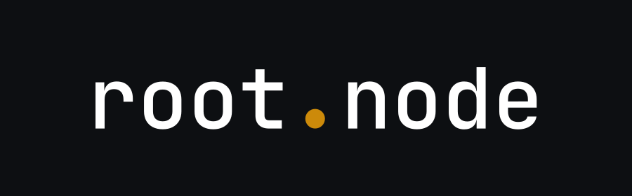
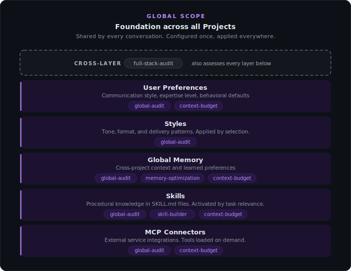
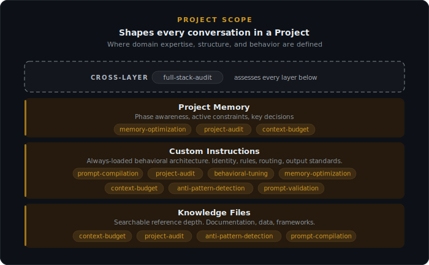
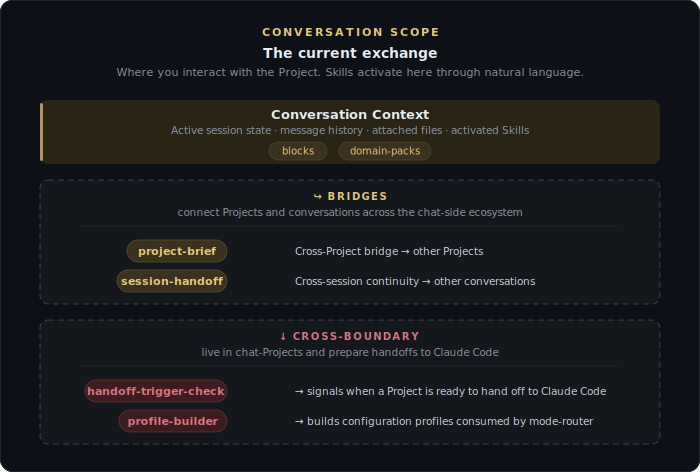
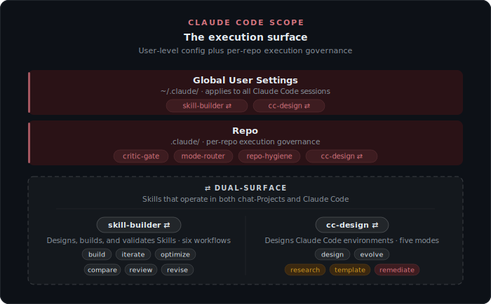

  

 

# root.node Skills

**The architecture system for Claude.**

27 Skills that diagnose, build, and optimize every architectural layer across chat-Projects, conversations, and Claude Code repos.

   

---

## Quick Start

These Skills install into two surfaces: **chat-Projects** (Claude.ai web app or Claude desktop app) and **Claude Code** (the execution surface). Most Skills are chat-Project-only. Three are Claude Code-only. Two operate in both.

**For chat-Projects.** Go to [Releases](https://github.com/drayline/rootnode-skills/releases), download the `-cp.zip` files for the Skills you want, then upload them in **Settings → Capabilities → Skills**. No unzipping required. Skills install once and become available across every Project in your Claude account.

**For Claude Code.** Go to [Releases](https://github.com/drayline/rootnode-skills/releases), download the `-cc.zip` files for the Skills you want, then extract them into `~/.claude/skills/` (user-level — available across every repo) or `.claude/skills/` (per-repo). Each archive expands to a folder matching the Skill name. Skills auto-activate from natural language prompts inside Claude Code sessions.

The two dual-surface Skills (`rootnode-skill-builder` and `rootnode-cc-design`) publish both `-cp.zip` and `-cc.zip` variants — download the one matching your install target.

> [!NOTE]
> Activate any Skill with natural language — no commands, no special syntax. Install all 27 for the full architecture system; every Skill also works standalone.

> [!TIP]
> **Calibrated for Claude Opus 4.7.** Most Skills work fully on every Claude model; a few produce best results on Opus. See [Model Compatibility](#model-compatibility) for details.

---

## Why Architecture Matters

The Claude ecosystem has a layered architecture. How content is distributed across those layers determines whether Claude performs at its potential or works against itself. The hard part isn't building a Project or wiring a Claude Code repo — it's seeing what's quietly working against you.

Architectural inefficiencies don't announce themselves. They surface as vague symptoms: output that drifts, instructions that get ignored intermittently, quality that degrades over long conversations, autonomous agents that escalate work they shouldn't or barrel through halts they should respect. These Skills surface those structural issues, triage them by impact, and produce targeted fixes.

The trap is that these symptoms look like behavior problems. They're not. A rule the user has rewritten five different ways still gets ignored because the layer it sits in is wrong, not because the rule is unclear. Cross-layer conflicts cause unpredictable output that no amount of prompt rewording will fix. Misplaced enforcement in a Claude Code environment becomes preference instead of guarantee. Structural problems require structural solutions.

These Skills treat the entire ecosystem as a unified system — scoring each layer, detecting cross-layer conflicts, diagnosing behavioral tendencies, gating handoffs to autonomous execution, and building Projects and Claude Code environments that are structurally sound from the start. The system is calibrated to how Claude actually processes context: the behavioral tendencies documented through extensive testing, the loading behavior of each layer, and the architectural patterns that produce reliable output across both surfaces.

---

## The Architectural Layers

Two surfaces, layered architecture across each. Skills are mapped to the layers they **impact**. A Skill that builds knowledge files appears on the Knowledge Files layer because that's the layer it modifies; a Skill that audits five layers at once appears on each of them.

**One Skill spans every layer.** `rootnode-full-stack-audit` runs Project audit + Global audit + Cross-Layer Alignment in a single pass — the only Skill in the catalog that operates across scopes rather than within one. See [Cross-Layer](#cross-layer) in Core Skills for details.

### Global Scope

  

 

Five layers shared across every chat-Project: User Preferences, Styles, Global Memory, Skills, and MCP Connectors. These define the foundation Claude works with before any specific Project loads. Edits here cascade across your entire Claude environment, which is why structural problems at the Global level are some of the most consequential — and most invisible — issues a user can have.

### Project Scope

  

 

Three layers that shape every conversation in a chat-Project: Project Memory (orientation state), Custom Instructions (always-loaded behavioral architecture), and Knowledge Files (searchable reference depth). Most chat-side quality issues originate here — wrong content in wrong layer, instructions that fight each other, retrieval mode pressure from oversized Knowledge Files. The majority of root.node's Core Skills target this scope because it's where structure most directly determines output.

### Conversation Scope

  

 

Where you interact with the chat-Project. Most Skills activate here from natural language — block selection, domain packs, identity templates, reasoning approaches, output formats. Two layers of continuity sit on top of the conversation:

**Bridges** connect within the chat-side ecosystem. `project-brief` captures Project context for use in other Projects; `session-handoff` preserves work state across separate conversations. Both produce artifacts designed to travel beyond the current exchange.

**Cross-boundary triggers** prepare handoffs from chat to Claude Code. `handoff-trigger-check` evaluates whether work-in-design is ready for autonomous execution against a 7-condition gate. `profile-builder` produces validated configuration profiles that downstream Claude Code Skills consume at runtime. Both live on the chat side; both produce artifacts that travel into the Claude Code surface.

### Claude Code Scope

  

 

The execution surface. Two layers mirror the chat-side hierarchy: **Global User Settings** (`~/.claude/` — user-level configuration plus dual-surface Skills) and **Repo** (`.claude/` — per-repo execution Skills that run inside Claude Code sessions).

Three Skills run inside the Repo layer at execution time: `critic-gate` evaluates work against profile-driven thresholds before merge; `mode-router` reads configuration profiles to route work by strictness; `repo-hygiene` runs a 14-category sweep + 7-layer leak check + anti-pattern detection across an existing CC deployment.

### Dual-Surface Skills

Two Skills operate in both surfaces. `rootnode-skill-builder` builds, validates, packages, and tests Skills that target either chat-Projects or Claude Code — six workflows including build, iterate, optimize, compare, review, and revise. `rootnode-cc-design` designs Claude Code environments — five modes spanning new deployments, evolution from friction, research, reusable templates, and remediation of hygiene findings.

These Skills install once and operate identically across the two surfaces, which is why the architecture diagram tags them with the dual-surface marker (⇄).

---

## Model Compatibility

Skills are calibrated against Claude Opus 4.7 as the primary target. They use a three-tier compatibility model based on how each Skill behaves across model classes.

**Tier 1 — Model-compatible (13 Skills).** Catalog retrievals, template lookups, decision logic, routing, and selection. Work fully on Opus, Sonnet, and Haiku. Output quality is consistent across models because the Skill's job is structured retrieval or rule evaluation, not multi-dimension analysis.

**Tier 2 — Sonnet-graceful (7 Skills).** Heavier analytical work that includes a token-budget awareness clause for graceful degradation. The Skill recognizes when running on a smaller model and adjusts depth without breaking. Output may be slightly less complete on Sonnet or Haiku, but every Skill component still produces.

**Tier 3 — Opus-recommended (7 Skills).** Multi-dimension analysis, full audits, complete environment design, and comprehensive Skill builds. These Skills run cleanly on Opus 4.7. Sonnet output may be less complete; Haiku output may miss higher-order findings. Each T3 Skill prints an effort guidance note on activation when run on a non-Opus model so you know what to expect.

The tier values appear in every catalog table below. T1 and T2 Skills are safe to use on any model. T3 Skills are best on Opus when the deliverable is high-stakes — full audits, comprehensive Skill builds, complete environment scaffolds.

---

## Core Skills

These operate directly on the architectural layers. They are the primary tools for building, diagnosing, and maintaining Claude environments across both surfaces.

### Build

| Skill | Tier | Surface | What It Does |
|---|---|---|---|
| `rootnode-prompt-compilation` | T3 | Chat | Four-stage pipeline (Parse, Select, Construct, Validate) that builds complete prompts and scaffolds entire Claude Projects — Custom Instructions, knowledge file architecture, and global layer advisory. |
| `rootnode-skill-builder` | T2 | Both ⇄ | Converts design specifications into deployment-ready Skill packages (SKILL.md + references/ + scripts/ + agents/). Six workflows including build, iterate, optimize, compare, review, revise. |
| `rootnode-cc-design` | T3 | Both ⇄ | Designs Claude Code environments. Five modes: design (new deployments, CLAUDE.md drafts, agent topology), evolve (updates from friction), research (evaluate CC tools/patterns), template (reusable artifacts), remediate (consume hygiene findings → produce + execute plan). |

### Diagnose

| Skill | Tier | Surface | What It Does |
|---|---|---|---|
| `rootnode-project-audit` | T3 | Chat | Scores a Project on six dimensions with anchored 1-5 rubrics. Finds what's broken and prescribes targeted fixes. |
| `rootnode-global-audit` | T3 | Chat | Audits all five global layers (Preferences, Styles, Memory, Skills, Connectors) using a six-dimension scorecard. Detects cross-layer failure modes. |
| `rootnode-anti-pattern-detection` | T2 | Chat | Detects seven structural patterns that cause ignored instructions and degraded output. |
| `rootnode-prompt-validation` | T2 | Chat | Six-dimension Prompt Scorecard for evaluating prompts. Maps each weakness to a structural fix. |
| `rootnode-repo-hygiene` | T3 | Code | 14-category sweep + 7-layer leak check + anti-pattern detection across an existing Claude Code deployment. Produces `HYGIENE_REPORT.md` consumable by `cc-design` REMEDIATE mode. |

### Optimize

| Skill | Tier | Surface | What It Does |
|---|---|---|---|
| `rootnode-behavioral-tuning` | T2 | Chat | Diagnoses ten Claude behavioral tendencies (verbosity, hedging, agreeableness, fabricated precision, and others) with countermeasure templates ready to deploy. |
| `rootnode-memory-optimization` | T2 | Chat | Rebalances content across Memory, Custom Instructions, knowledge files, and User Preferences. Produces edit prescriptions and trimming recommendations. |
| `rootnode-context-budget` | T3 | Chat | Full context budget analysis: two-pool architecture (~66,500 token RAG threshold), per-file evaluation across six dimensions, content routing by category, growth trajectory assessment, retrieval quality audit, and phased optimization with compression safeguards. |

### Cross-Layer

This Skill operates across the architecture rather than within a single scope. It runs every layer-level audit and the alignment check between layers in a single pass — the most comprehensive diagnostic in the catalog.

| Skill | Tier | Surface | What It Does |
|---|---|---|---|
| `rootnode-full-stack-audit` | T3 | Chat | Runs Project audit + Global audit + Cross-Layer Alignment Check in a single pass. Scores both Project and Global layers using their respective six-dimension scorecards, detects cross-layer failure modes that single-scope audits can't see, and produces a unified action plan ordered by impact. |

### Bridge

These Skills produce artifacts that travel between conversations and chat-Projects. Their output is designed to be uploaded into a different context.

| Skill | Tier | Surface | What It Does |
|---|---|---|---|
| `rootnode-project-brief` | T1 | Chat | Generates a structured Project Brief — extracts goals, architecture, knowledge file inventory, Custom Instructions summary, Memory contents, current state, and key decisions from a Claude Project. Briefs serve as uploadable context for cross-Project work. |
| `rootnode-session-handoff` | T1 | Chat | Produces structured XML session continuation documents. Captures active work streams, decisions with rationale, uploaded file content, conversation knowledge, and open items into an ingestion-optimized handoff file. |

### Cross-Boundary Triggers

These Skills live on the chat side but produce artifacts consumed by Claude Code. They prepare and gate the handoff from design-side work into autonomous execution.

| Skill | Tier | Surface | What It Does |
|---|---|---|---|
| `rootnode-handoff-trigger-check` | T1 | Chat | Evaluates whether work-in-design is ready to hand off from a chat conversation to autonomous execution. Runs a 7-condition gate (spec stability, verification surface, invariants, pump-primer, work decomposition, rollback cost, token budget headroom) and returns a structured JSON verdict. |
| `rootnode-profile-builder` | T1 | Chat | Conversational profile builder. Reads a target JSON Schema, conducts a progressive-depth interview, validates answers, and writes the resulting profile to a destination path. Schema-agnostic — produces validated configs for any Skill that consumes profile-shaped data, including `mode-router` and `critic-gate`. |

### Runtime

These Skills run inside Claude Code at execution time. They consume profile artifacts from `profile-builder` and gate or route work according to configured strictness.

| Skill | Tier | Surface | What It Does |
|---|---|---|---|
| `rootnode-critic-gate` | T2 | Code | Profile-driven gate that evaluates work against configured thresholds before merge or handoff. Reads a critic profile produced by `profile-builder`, applies the gate, returns a structured verdict with rationale. |
| `rootnode-mode-router` | T1 | Code | Profile-driven router that reads a mode configuration and routes work by strictness, scope, or context. The runtime counterpart to chat-side `block-selection` — same selection logic, different surface. |

---

## Supporting Skills

These activate automatically in the background when Core Skills need them. They provide the specialized methodology that the Compiler and audit tools draw on during assembly and evaluation.

### Block Libraries

Deep catalogs of tested prompt approaches. The Compiler selects from these during prompt and Project assembly.

| Skill | Tier | Contents |
|---|---|---|
| `rootnode-block-selection` | T2 | Decision trees for choosing the right identity, reasoning, and output approach for any task type. The router for the libraries below. |
| `rootnode-identity-blocks` | T1 | 8 identity approaches (Strategic Advisor, Technical Architect, Research Synthesist, and more) |
| `rootnode-reasoning-blocks` | T1 | 18 reasoning variants across 6 categories (Analytical, Strategic, Creative, Technical, Research, Comparative) |
| `rootnode-output-blocks` | T1 | 10 output format specifications (Executive Brief, Technical Design, Decision Matrix, and more) |

### Domain Packs

Specialized identity, reasoning, and output approaches tuned for specific professional domains. The Compiler selects from these automatically when building domain-specific prompts or Projects.

| Skill | Tier | Domain |
|---|---|---|
| `rootnode-domain-business-strategy` | T1 | Consulting, competitive analysis, corporate strategy, M&A |
| `rootnode-domain-software-engineering` | T1 | System design, code review, incident response, security, API design |
| `rootnode-domain-content-communications` | T1 | Writing, editing, content strategy, copywriting, persuasion |
| `rootnode-domain-research-analysis` | T1 | Data analysis, policy research, evidence synthesis, systematic review |
| `rootnode-domain-agentic-context` | T1 | AI agent design, tool interfaces, context architecture, multi-agent coordination |

---

## How Skills Compose

With all 27 installed, Skills compose naturally around the work — chat-side or code-side. Keyword phrases trigger the right combination automatically.

| You Say | What Happens |
|---|---|
| "Build me a Claude Project for our engineering team's code review workflow." | Compilation builds the full scaffold — Custom Instructions, knowledge file architecture, global layer advisory. The software engineering domain pack provides specialized approaches. |
| "Audit my project. Output quality has been inconsistent." | Project audit scores six dimensions, detects anti-patterns, and produces prioritized fixes grounded in evidence from your Project. |
| "Run a full stack audit of everything — my project and my global setup." | Full-stack audit runs both Project and Global scorecards, checks cross-layer alignment across all nine layers, and produces a unified action plan. |
| "Design a Claude Code environment for our deployment automation repo." | `cc-design` DESIGN mode produces a CLAUDE.md draft with R1–R5 required sections, agent topology, scope authorization clauses, halt-and-escalate triggers, and a Skills/hooks/MCP plan tuned to the repo. |
| "Are we ready to hand this off to Claude Code?" | `handoff-trigger-check` walks the 7-condition gate (spec stability, verification surface, invariants, pump-primer, work decomposition, rollback cost, token budget) and returns a structured verdict with what's missing. |
| "Run a hygiene check on this Claude Code repo." | `repo-hygiene` runs the 14-category sweep, 7-layer leak check, and anti-pattern detection. Produces `HYGIENE_REPORT.md` ready for `cc-design` REMEDIATE mode to consume. |
| "Capture this Project's context so I can use it in another Project." | Project brief generates a structured upload-ready document with the Project's goals, architecture, knowledge files, instructions summary, and key decisions. |

<strong>More examples</strong>

 

| You Say | What Happens |
|---|---|
| "Wrap up this session. Build a handoff for the next conversation." | Session handoff captures active work streams, decisions with rationale, open items, and a starter prompt for the next conversation. |
| "Build me a Claude Project for an agent that does research and writes reports." | Compilation builds the full scaffold. The agentic domain pack provides agent-specific methodology: tool interface design, context architecture, failure mode planning. |
| "What's wrong with my project? Claude keeps ignoring my instructions." | Anti-pattern detection checks for seven structural patterns. Every finding quotes the specific text causing the problem. |
| "Optimize my memory. I think it needs to be trimmed." | Memory optimization audits for redundancy and staleness, identifies what should be promoted to Preferences or demoted to knowledge files, and produces specific edit prescriptions. |
| "Claude keeps agreeing with everything and won't push back." | Behavioral tuning diagnoses the specific tendencies and provides countermeasure templates to deploy in Custom Instructions. |
| "Run a context budget analysis." | Runs a full context budget analysis — per-file evaluation, content routing, retrieval quality — and recommends goal-informed optimizations for your Project. |
| "Set up a critic profile for this repo's CI." | `profile-builder` walks an interview against the critic-gate schema, validates answers, and writes the profile. `critic-gate` then reads it at runtime to evaluate every change against your configured thresholds. |
| "Build this Skill from my design spec." | Skill builder converts your spec into a deployment-ready package (SKILL.md + references/ + scripts/ + agents/) following the full Skills specification, with a 9-dimension quality gate before ship. |
| "Help me pick the right reasoning approach for this analytical task." | Block selection walks the decision tree across the 18 reasoning variants and recommends the best fit with rationale. |

---

## Roadmap

**Routine deployment.** Scheduled Claude Code surfaces — daily-triad (three sequential passes) and weekly-audit patterns — for teams that want continuous-watch governance instead of session-by-session invocation. The composition pattern is locked; the Routine deployment is in active design.

**rootnode-for-code plugin.** A curated bundle of the highest-impact CC Skills shipped as a single plugin install for Claude Code users who want the system without picking Skills à la carte.

**Calibration Engine.** Automated regression testing for every Skill against new Claude model releases. When a new Opus or Sonnet ships, the Calibration Engine catches behavioral drift before it lands in user environments and recalibrates countermeasures across the catalog.

---

## About

root.node is an open-source architecture system for Claude. These Skills are its deployable layer. The framework documentation, architectural references, and worked examples live at **[rootnode.design](https://rootnode.design)**.

---

## Feedback

These Skills are actively refined based on real-world usage. If something doesn't work the way you'd expect, or there's a workflow you wish existed, [open an issue](https://github.com/drayline/rootnode-skills/issues).

---

## License

Apache-2.0. See [LICENSE](LICENSE).
