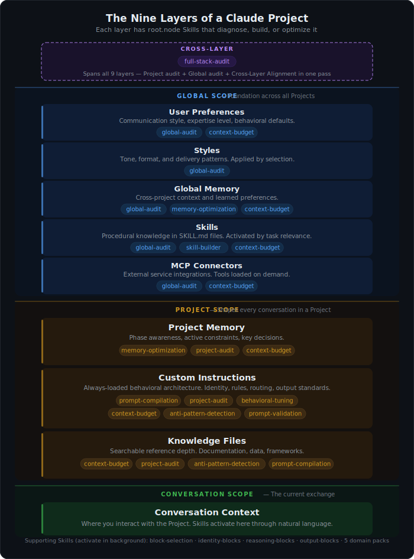
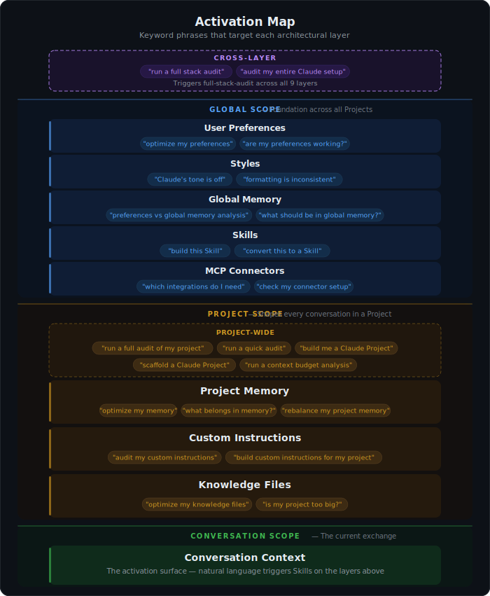

# root.node Skills

**The architecture system for Claude Projects.**

19 Skills that diagnose, build, and optimize every layer of a Claude Project — from a single prompt to your entire Claude environment.

  

---

## Quick Start

**Claude.ai** — Go to [Releases](https://github.com/drayline/rootnode-skills/releases), download the `.zip` files for the Skills you want, then upload them in **Settings → Capabilities → Skills**. No unzipping required.

**Claude Code** — Clone the repo and point your Skills directory to the skill folders:
```bash
git clone https://github.com/drayline/rootnode-skills.git
```

**API** — Add skill folders to your Messages API request via the `container.skills` parameter (requires Code Execution Tool beta).

> [!NOTE]
> Install all 19 for the full system. Every Skill also works standalone.

---

## Why Architecture Matters

Claude Projects have a nine-layer architecture. How content is distributed across those layers determines whether Claude performs at its potential or works against itself.

The hard part isn't building a Project — it's seeing what's quietly working against you. Architectural inefficiencies don't announce themselves. They surface as vague symptoms: output that drifts, instructions that get ignored intermittently, quality that degrades over long conversations. These Skills surface those structural issues, triage them by impact, and produce targeted fixes.

A rule in the wrong layer gets ignored. A preference that should be global gets restated in every Project. Context budget gets consumed by content that belongs somewhere else. Cross-layer conflicts cause unpredictable output that no amount of prompt rewording will fix.

These Skills treat the entire architecture as a unified system — scoring each layer, detecting cross-layer conflicts, diagnosing behavioral tendencies, and building Projects that are structurally sound from the start. The system is calibrated to how Claude actually processes context: the behavioral tendencies documented through extensive testing, the loading behavior of each layer, and the architectural patterns that produce reliable output.

---

## The Nine Layers

Global layers form the foundation that spans all Projects. Project layers shape behavior within a single Project. The Conversation layer is where you interact with the system — Skills activate here through natural language, operating on the layers above.

Each layer has root.node Skills that diagnose, build, or optimize it.

<div align="center">
  
</div>

<br>

The **Activation Map** shows how to target each layer. These keyword phrases trigger the right Skills automatically — you don't need to know which Skill handles what.

<div align="center">
  
</div>

---

## Core Skills

These operate directly on the architectural layers. They are the primary tools for building and maintaining Claude Projects.

### Build

| Skill | What It Does |
|---|---|
| `rootnode-prompt-compilation` | Four-stage pipeline (Parse, Select, Construct, Validate) that builds complete prompts and scaffolds entire Claude Projects — Custom Instructions, knowledge file architecture, and global layer advisory. |
| `rootnode-skill-builder` | Converts design specifications into deployment-ready Skill packages (SKILL.md + references/). |

### Diagnose

| Skill | What It Does |
|---|---|
| `rootnode-project-audit` | Scores a Project on six dimensions with anchored 1-5 rubrics. Finds what's broken and prescribes targeted fixes. |
| `rootnode-global-audit` | Audits all five global layers (Preferences, Styles, Memory, Skills, Connectors) using a six-dimension scorecard. Detects cross-layer failure modes. |
| `rootnode-full-stack-audit` | Combines Project audit + Global audit + Cross-Layer Alignment into a single comprehensive evaluation with a unified action plan. |
| `rootnode-anti-pattern-detection` | Detects seven structural patterns that cause ignored instructions and degraded output. |
| `rootnode-prompt-validation` | Six-dimension Prompt Scorecard for evaluating prompts. Maps each weakness to a structural fix. |

### Optimize

| Skill | What It Does |
|---|---|
| `rootnode-behavioral-tuning` | Diagnoses eight Claude behavioral tendencies (verbosity, hedging, agreeableness, and others) with countermeasure templates ready to deploy. |
| `rootnode-memory-optimization` | Rebalances content across Memory, Custom Instructions, knowledge files, and User Preferences. Produces edit prescriptions and trimming recommendations. |
| `rootnode-context-budget` | Full context budget analysis: two-pool architecture (~66,500 token RAG threshold), per-file evaluation across six dimensions, content routing by category, growth trajectory assessment, retrieval quality audit, and phased optimization with compression safeguards. |

---

## Supporting Skills

These activate automatically in the background when Core Skills need them. They provide the specialized methodology that the Compiler and audit tools draw on during assembly and evaluation.

### Block Libraries

Deep catalogs of tested prompt approaches. The Compiler selects from these during prompt and Project assembly.

| Skill | Contents |
|---|---|
| `rootnode-block-selection` | Decision trees for choosing the right identity, reasoning, and output approach for any task type. The router for the libraries below. |
| `rootnode-identity-blocks` | 8 identity approaches (Strategic Advisor, Technical Architect, Research Synthesist, and more) |
| `rootnode-reasoning-blocks` | 18 reasoning variants across 6 categories (Analytical, Strategic, Creative, Technical, Research, Comparative) |
| `rootnode-output-blocks` | 10 output format specifications (Executive Brief, Technical Design, Decision Matrix, and more) |

### Domain Packs

Specialized identity, reasoning, and output approaches tuned for specific professional domains. The Compiler selects from these automatically when building domain-specific prompts or Projects.

| Skill | Domain |
|---|---|
| `rootnode-domain-business-strategy` | Consulting, competitive analysis, corporate strategy, M&A |
| `rootnode-domain-software-engineering` | System design, code review, incident response, security, API design |
| `rootnode-domain-content-communications` | Writing, editing, content strategy, copywriting, persuasion |
| `rootnode-domain-research-analysis` | Data analysis, policy research, evidence synthesis, systematic review |
| `rootnode-domain-agentic-context` | AI agent design, tool interfaces, context architecture, multi-agent coordination |

---

## How Skills Compose

With all 19 installed, Skills compose naturally around the Project lifecycle. Keyword phrases in your messages trigger the right combination automatically.

| You Say | What Happens |
|---|---|
| "Build me a Claude Project for our engineering team's code review workflow." | Compilation builds the full scaffold — Custom Instructions, knowledge file architecture, global layer advisory. The software engineering domain pack provides specialized approaches. |
| "Audit my project. Output quality has been inconsistent." | Project audit scores six dimensions, detects anti-patterns, and produces prioritized fixes grounded in evidence from your Project. |
| "Run a full stack audit of everything — my project and my global setup." | Full-stack audit runs both Project and Global scorecards, checks cross-layer alignment across all nine layers, and produces a unified action plan. |
| "Claude keeps agreeing with everything and won't push back." | Behavioral tuning diagnoses the specific tendencies and provides countermeasure templates to deploy in Custom Instructions. |
| "Run a context budget analysis." | Runs a full context budget analysis — per-file evaluation, content routing, retrieval quality — and recommends goal-informed optimizations for your Project. |

<details>
<summary><strong>More examples</strong></summary>
<br>

| You Say | What Happens |
|---|---|
| "Build me a Claude Project for an agent that does research and writes reports." | Compilation builds the full scaffold. The agentic domain pack provides agent-specific methodology: tool interface design, context architecture, failure mode planning. |
| "What's wrong with my project? Claude keeps ignoring my instructions." | Anti-pattern detection checks for seven structural patterns. Every finding quotes the specific text causing the problem. |
| "Optimize my memory. I think it needs to be trimmed." | Memory optimization audits for redundancy and staleness, identifies what should be promoted to Preferences or demoted to knowledge files, and produces specific edit prescriptions. |
| "Review this prompt and tell me how to improve it." | Prompt validation scores six dimensions, maps each weakness to a structural cause, and prescribes targeted fixes. |
| "Build this Skill from my design spec." | Skill builder converts your spec into a deployment-ready SKILL.md + references/ package following the full Skills specification. |

</details>

---

## The Full System

These Skills are extracted from the root.node methodology — a complete architecture system for Claude Projects. The full system includes the integrated Compiler and Optimizer pipelines, worked examples with detailed architectural annotations, and the Project construction methodology that produced these Skills.

Learn more at **[rootnode.design](https://rootnode.design)**.

---

## Feedback

These Skills are actively refined based on real-world usage. If something doesn't work the way you'd expect or there's a workflow you wish existed, [open an issue](https://github.com/drayline/rootnode-skills/issues).

---

## License

Apache-2.0. See [LICENSE](LICENSE).
